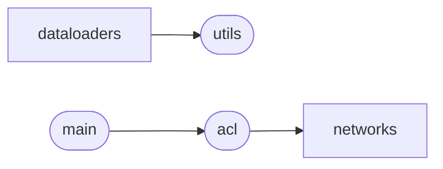

# Code Overview

[_Documentation generated by Documatic_](https://www.documatic.com)

<!---Documatic-section-Codebase Structure Python-start--->
## Codebase Structure Python

The codebase has a single-depth folder structure,
                with 13 code files in total.

<!---Documatic-block-system_architecture-start--->

<!---Documatic-block-system_architecture-end--->

# #
<!---Documatic-section-Codebase Structure Python-end--->

<!---Documatic-section-Important Functions-start--->
## Important Functions

<!---Documatic-block-important_funcs-start--->
<!---Documatic-block-most_used_funcs-start--->
### Most Utilised Functions

* [src.utils.compute_conv_output_size](3-src_utils.md#src.utils.compute_conv_output_size) (4 times)
* [src.utils.get_model](3-src_utils.md#src.utils.get_model) (4 times)
* [src.utils.human_format](3-src_utils.md#src.utils.human_format) (4 times)
* [src.utils.make_directories](3-src_utils.md#src.utils.make_directories) (4 times)
* [src.utils.print_log_acc_bwt](3-src_utils.md#src.utils.print_log_acc_bwt) (4 times)
* [src.utils.print_running_acc_bwt](3-src_utils.md#src.utils.print_running_acc_bwt) (4 times)
* [src.utils.print_time](3-src_utils.md#src.utils.print_time) (4 times)
* [src.utils.report_tr](3-src_utils.md#src.utils.report_tr) (4 times)
* [src.utils.report_val](3-src_utils.md#src.utils.report_val) (4 times)
* [src.utils.save_code](3-src_utils.md#src.utils.save_code) (4 times)
* [src.utils.save_print_log](3-src_utils.md#src.utils.save_print_log) (4 times)
* [src.utils.some_sanity_checks](3-src_utils.md#src.utils.some_sanity_checks) (4 times)
<!---Documatic-block-most_used_funcs-end--->
<!---Documatic-block-important_funcs-end--->

# #
<!---Documatic-section-Important Functions-end--->

<!---Documatic-section-File IO-start--->
## File IO

<!---Documatic-block-file_io-start--->
The following files have file read operations

<!---Documatic-block-src.dataloaders-start--->

	
<code>src.dataloaders</code> (Click to Expand!)

* src.dataloaders.cifar100
* src.dataloaders.datasets_utils
* src.dataloaders.miniimagenet
* src.dataloaders.utils

<!---Documatic-block-src.dataloaders-end--->

The following files have file write operations

<!---Documatic-block-src-start--->

	
<code>src</code> (Click to Expand!)

* src.utils

<!---Documatic-block-src-end--->

<!---Documatic-block-src.dataloaders-start--->

	
<code>src.dataloaders</code> (Click to Expand!)

* src.dataloaders.datasets_utils
* src.dataloaders.utils

<!---Documatic-block-src.dataloaders-end--->
<!---Documatic-block-file_io-end--->

# #
<!---Documatic-section-File IO-end--->

<!---Documatic-section-Class Hierarchy-start--->
## Class Hierarchy

<!---Documatic-block-datasets.CIFAR10-start--->

	
<code>datasets.CIFAR10</code> (Click to Expand!)

* src.dataloaders.cifar100.iCIFAR10
* src.dataloaders.datasets_utils.CIFAR10_

<!---Documatic-block-datasets.CIFAR10-end--->

<!---Documatic-block-datasets.MNIST-start--->

	
<code>datasets.MNIST</code> (Click to Expand!)

* src.dataloaders.datasets_utils.MNIST_RGB
* src.dataloaders.mnist5.iMNIST

<!---Documatic-block-datasets.MNIST-end--->

<!---Documatic-block-object-start--->

	
<code>object</code> (Click to Expand!)

* src.acl.ACL
* src.dataloaders.cifar100.DatasetGen
* src.dataloaders.miniimagenet.DatasetGen
* src.dataloaders.mulitidatasets.DatasetGen

<!---Documatic-block-object-end--->

<!---Documatic-block-src.dataloaders.cifar100.iCIFAR10-start--->

	
<code>src.dataloaders.cifar100.iCIFAR10</code> (Click to Expand!)

* src.dataloaders.cifar100.iCIFAR100

<!---Documatic-block-src.dataloaders.cifar100.iCIFAR10-end--->

<!---Documatic-block-src.dataloaders.datasets_utils.CIFAR10_-start--->

	
<code>src.dataloaders.datasets_utils.CIFAR10_</code> (Click to Expand!)

* src.dataloaders.datasets_utils.CIFAR100_

<!---Documatic-block-src.dataloaders.datasets_utils.CIFAR10_-end--->

<!---Documatic-block-src.dataloaders.datasets_utils.MNIST_RGB-start--->

	
<code>src.dataloaders.datasets_utils.MNIST_RGB</code> (Click to Expand!)

* src.dataloaders.datasets_utils.FashionMNIST_

<!---Documatic-block-src.dataloaders.datasets_utils.MNIST_RGB-end--->

<!---Documatic-block-src.dataloaders.miniimagenet.MiniImageNet-start--->

	
<code>src.dataloaders.miniimagenet.MiniImageNet</code> (Click to Expand!)

* src.dataloaders.miniimagenet.iMiniImageNet

<!---Documatic-block-src.dataloaders.miniimagenet.MiniImageNet-end--->

<!---Documatic-block-torch.nn.Module-start--->

	
<code>torch.nn.Module</code> (Click to Expand!)

* src.acl.DiffLoss

<!---Documatic-block-torch.nn.Module-end--->

<!---Documatic-block-torch.utils.data.Dataset-start--->

	
<code>torch.utils.data.Dataset</code> (Click to Expand!)

* src.dataloaders.miniimagenet.MiniImageNet

<!---Documatic-block-torch.utils.data.Dataset-end--->

# #
<!---Documatic-section-Class Hierarchy-end--->

[_Documentation generated by Documatic_](https://www.documatic.com)